# tinygo-cyd コード解説

ESP32-4827S043（ESP32-S3 + 4.3インチ 480×272 RGB 液晶）を TinyGo で動かすためのコード一式の解説。
「どこに何があり、なぜそうなっているか」を、今後自分で直せることを目標に説明する。

- 図は Mermaid で書いている。GitHub や VS Code（Markdown Preview Mermaid Support 拡張）で図として表示される。
- リンクはリポジトリ内のファイル（行番号付きのものもある）。行番号は 2026-10 時点のもの。
- 理解度の確認は [QUIZ.md](QUIZ.md)、解答は [QUIZ_ANSWERS.md](QUIZ_ANSWERS.md)（どちらも手元だけに置き、git では管理しない）。

## 目次

1. [用語](#1-用語)
2. [全体像](#2-全体像)
3. [ビルドの切り替え（実機・ブラウザ・ホスト）](#3-ビルドの切り替え実機ブラウザホスト)
4. [液晶表示の仕組み（rgblcd）](#4-液晶表示の仕組みrgblcd)
5. [メモリの使い方](#5-メモリの使い方)
6. [描画 API とバックエンド](#6-描画-api-とバックエンド)
7. [ブラウザ版（wasmlcd）](#7-ブラウザ版wasmlcd)
8. [テスト](#8-テスト)
9. [タッチパネル](#9-タッチパネル)
10. [フラッシュとスライドショー（05）](#10-フラッシュとスライドショー05)
11. [SD カードのスライドショー（06）](#11-sd-カードのスライドショー06)
12. [ゲーム（07・08）](#12-ゲーム0708)
13. [運用：コマンド・よくある作業・トラブル](#13-運用コマンドよくある作業トラブル)
14. [未解決・注意事項](#14-未解決注意事項)

---

## 1. 用語

| 用語 | 意味 |
|---|---|
| RGB565 | 1画素 16bit の色形式。上位から R 5bit・G 6bit・B 5bit。 |
| RGB565BE | RGB565 を「上位バイト → 下位バイト」の順にバイト列で並べたもの（ビッグエンディアン）。`DrawRGBBitmap8` と画像ファイルがこの形式。 |
| フレームバッファ | 画面全体の画素を入れたメモリ。ここでは `[]uint16`（RGB565、行優先、480×272）。 |
| PCLK | ピクセルクロック。1クロックで1画素を液晶に送る。ここでは 9MHz。 |
| HSYNC / VSYNC | 水平・垂直同期信号。行の始まり・フレームの始まりを液晶に知らせる。 |
| DE | Data Enable。「今送っているのは表示データ」という信号。 |
| ポーチ | 同期パルスの前後の空白期間（front porch / back porch）。 |
| LCD_CAM | ESP32-S3 の液晶・カメラ用ペリフェラル。RGB パラレル出力を作る。 |
| GDMA | ESP32-S3 の汎用 DMA。メモリから LCD_CAM へデータを流す。 |
| ディスクリプタ | DMA に「どのメモリを何バイト送るか、次はどれか」を教える 12 バイトの構造体。 |
| GPIO マトリクス / IO_MUX | ペリフェラルの信号を任意の GPIO ピンにつなぐ仕組み。 |
| DROM / IROM | フラッシュをキャッシュ経由でメモリとして見せるアドレス空間（データ用 0x3C000000〜 / 命令用 0x42000000〜）。 |
| MMU | 上の仮想アドレスとフラッシュの物理位置を対応付ける表。64KB ページ単位。 |
| hal | このリポジトリのアプリが依存するインターフェース（`hal.Display`、`hal.Touch`）。 |
| ゴールデン画像 | 「正しい画面」として保存した PNG。テストで描画結果とピクセル単位で比較する。 |

---

## 2. 全体像

### ディレクトリ

| ディレクトリ | 役割 | 動く場所 |
|---|---|---|
| [board/](../board/board.go) | ピン番号・タイミング・キャリブレーション値など**ボード固有の値をすべて**ここに置く | 全部 |
| [hal/](../hal/hal.go) | アプリが依存するインターフェース `Display`・`Touch` | 全部 |
| [framebuf/](../framebuf/framebuf.go) | RGB565 フレームバッファへの描画（点・矩形・ビットマップ） | 全部 |
| [rgblcd/](../rgblcd/) | **LCD_CAM + GDMA の液晶ドライバ**（このリポジトリの中心） | 実機（計算部分はホストでもテスト） |
| [wasmlcd/](../wasmlcd/wasmlcd.go) | ブラウザの canvas に表示・マウス/タッチを入力にする | ブラウザ |
| [memlcd/](../memlcd/memlcd.go) | メモリ上の表示（テスト用、PNG 出力） | ホスト |
| [platform/](../platform/) | ビルド先に応じて上の3つを選んで初期化 | 全部 |
| [xpttouch/](../xpttouch/) | XPT2046 タッチの読み取りとキャリブレーション | 実機（計算はホストでもテスト） |
| [flashmap/](../flashmap/flashmap.go) | フラッシュの任意の領域を MMU でメモリとして読めるようにする | 実機 |
| [slidepack/](../slidepack/slidepack.go) | 複数の全画面画像を1ファイルにまとめる形式 | 全部 |
| [slideshow/](../slideshow/) | スライドショー本体（切り替え効果・キャプション・タッチ操作）と SD 用の読み込み | 全部 |
| [app/](../app/app.go) | お絵描きアプリ（`cmd/app` の中身） | 全部 |
| [cmd/app/](../cmd/app/main.go) | 実機・ブラウザ共通のエントリポイント | 全部 |
| [examples/](../examples/) | 01〜08 のサンプル | 例ごとに異なる |
| [internal/](../internal/) | テスト補助（goldentest）、C 用 malloc 補助（espmalloc） | — |
| [tools/](../tools/) | 画像変換（img2rgb565）、HTTP サーバ（serve）、ブラウザ検査（wasmcheck） | ホスト |
| [targets/](../targets/esp32-4827s043.json) | TinyGo のカスタムターゲット | — |
| [web/](../web/index.html) | ブラウザ版の HTML | ブラウザ |
| [testdata/golden/](../testdata/golden/) | ゴールデン画像 | ホスト |

### 依存関係

アプリ（`app`、`slideshow`、ゲーム）は `hal` にしか依存しない。だから同じコードが実機でもブラウザでもテストでも動く。

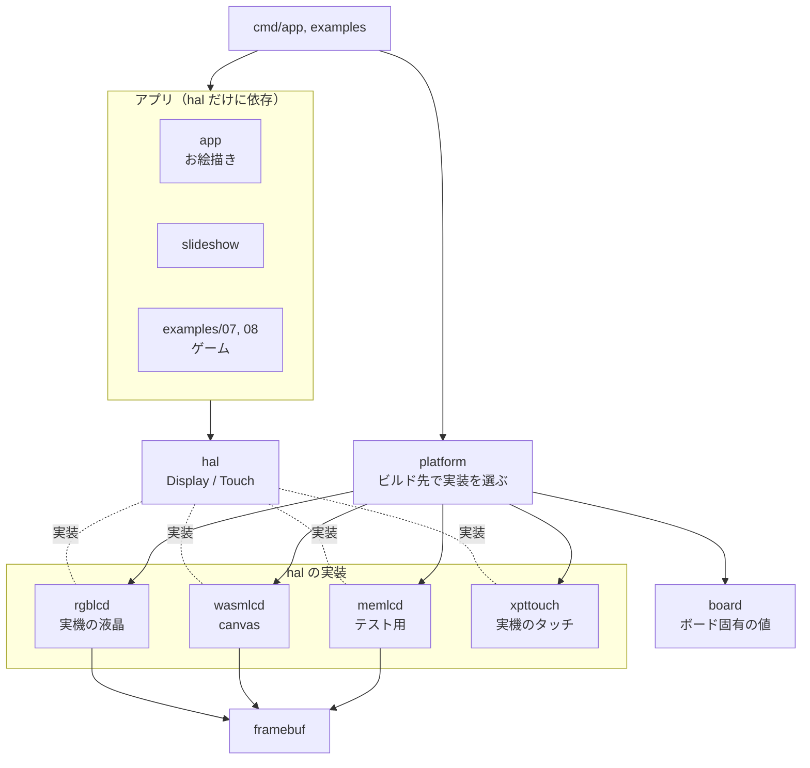

---

## 3. ビルドの切り替え（実機・ブラウザ・ホスト）

同じソースから3種類のプログラムを作る。どのファイルを使うかは **Go のビルドタグ**（ファイル先頭の `//go:build ...`）で決まる。

| ビルド | コマンド | 有効なタグ | `platform.Init()` の実体 |
|---|---|---|---|
| 実機 | `tinygo build -target=./targets/esp32-4827s043.json` | `esp32s3` ほか | [platform_esp32s3.go](../platform/platform_esp32s3.go)：rgblcd + xpttouch |
| ブラウザ | `tinygo build -target=wasm` | `js`, `wasm` | [platform_wasm.go](../platform/platform_wasm.go)：wasmlcd（表示とタッチを兼ねる） |
| ホスト | `go test` / `go run` | （なし） | [platform_other.go](../platform/platform_other.go)：memlcd + 押されないタッチ |

- `machine` パッケージ（GPIO など）を使うファイルは必ず `//go:build esp32s3` を付ける。付けないとホストの `go test ./...` が「package machine is not in std」で失敗する。
- `rgblcd` は「計算だけのファイル（タグなし）」と「レジスタを触るファイル（esp32s3）」に分かれている。計算部分（[calc.go](../rgblcd/calc.go)）はホストでテストできる。

### カスタムターゲット [targets/esp32-4827s043.json](../targets/esp32-4827s043.json)

```json
{
  "inherits": ["esp32s3-generic"],   // machine パッケージが SPI のピン定数を要求するため generic を継承
  "build-tags": ["esp32_4827s043"],
  "serial": "uart",                  // USB-C は CH340C 経由で UART0 につながっている
  "flash-method": "esp32flash",      // UART 経由の書き込み
  "ldflags": ["--defsym=Cache_Invalidate_Addr=0x400016b0", ...]  // flashmap が使う ROM 関数の番地
}
```

---

## 4. 液晶表示の仕組み（rgblcd）

### 4.1 データの流れ

**CPU は画面を「送らない」**。フレームバッファに書くだけで、あとは GDMA と LCD_CAM が毎秒約57回、勝手に液晶へ送り続ける。

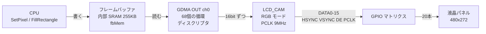

- フレームバッファの1画素（`uint16`）の bit0〜15 が、そのまま LCD_CAM の `DATA_OUT0〜15` に出る。
- [board.DataPins()](../board/board.go) が `DATA_OUT0〜4 = B0〜B4`、`5〜10 = G0〜G5`、`11〜15 = R0〜R4` の順にピンを並べる。これで普通の RGB565（上位 5bit が赤）がそのまま正しい色になる。

### 4.2 パネルの信号タイミング

1行 = 4（HSYNC）+ 43（バックポーチ）+ 480（表示）+ 8（フロントポーチ）= **535 PCLK**。
1フレーム = 4 + 12 + 272 + 8 = **296 行**。9MHz ÷ (535 × 296) ≒ **56.83 fps**。

```
1行（PCLK 単位）
HSYNC  ‾‾‾‾|____|‾‾‾‾‾‾‾‾‾‾‾‾‾‾‾‾‾‾‾‾‾‾‾‾‾‾‾‾‾‾‾‾‾‾‾‾‾‾‾‾‾‾‾‾‾‾‾‾‾‾‾‾‾‾‾‾|____|‾‾  ← ※実際の極性は下表
            4      43           480（DE=1、データ）          8
DE     ________________________|‾‾‾‾‾‾‾‾‾‾‾‾‾‾‾‾‾‾‾‾‾‾‾‾‾‾‾‾‾|_______________
           パルス  バックポーチ           表示            フロントポーチ
```

| 設定（[board.go](../board/board.go)） | 値 | 意味 |
|---|---|---|
| `PclkHz` | 9_000_000 | 不安定なら 8MHz → 7MHz に下げる |
| `HSyncIdleLow` / `VSyncIdleLow` | true | 待機時 Low（Arduino_GFX の polarity 0） |
| `PclkActiveNeg` | true | PCLK の立ち下がりでデータを出す |
| `DEIdleHigh` | false | 待機時 DE は Low |

### 4.3 クロックの計算（[CalcClock](../rgblcd/calc.go#L27)）

ESP-IDF の `lcd_hal_cal_pclk_freq` をそのまま移植したもの。

```
lcd_clk   = ソース ÷ (N + B/A)
pixel_clk = lcd_clk ÷ MO
```

9MHz の場合：ソース PLL_F160M = 160MHz。`PclkActiveNeg` があると `MO = 1` は使えない（極性を変えられないため）ので MO = 2。
160 ÷ 18 = 8 余り 16 → **N=8、A=9、B=8、MO=2**。lcd_clk = 18MHz、pclk = 9MHz ちょうど。
実機のレジスタ値 `LCD_CLOCK=e4901101` はこの値を含む。

### 4.4 タイミングレジスタ（[CalcTiming](../rgblcd/calc.go#L109)）

ESP-IDF `lcd_ll_set_horizontal_timing` / `lcd_ll_set_vertical_timing` の変換式（レジスタには「値 − 1」を書く）。

| フィールド | 式 | 値 |
|---|---|---|
| `LCD_HSYNC_WIDTH` | hsw − 1 | 3 |
| `LCD_HB_FRONT` | hbp + hsw − 1 | 46 |
| `LCD_HA_WIDTH` | 幅 − 1 | 479 |
| `LCD_HT_WIDTH` | hsw + hbp + 幅 + hfp − 1 | 534 |
| `LCD_VSYNC_WIDTH` | vsw − 1 | 3 |
| `LCD_VB_FRONT` | vbp + vsw − 1 | 15 |
| `LCD_VA_HEIGHT` | 高さ − 1 | 271 |
| `LCD_VT_HEIGHT` | vsw + vbp + 高さ + vfp − 1 | 295 |

各フィールドにはビット幅の上限があり（例：`VT_HEIGHT` は 10bit = 1023 まで）、超えると `ErrBadTiming`。

### 4.5 DMA ディスクリプタ（[gdma.go](../rgblcd/gdma.go)、[DescLayout](../rgblcd/calc.go#L173)）

1つのディスクリプタで送れるのは最大 4095 バイト。1行 = 960 バイトなので、**4行（3840 バイト）× 68 個**に分ける。最後のディスクリプタの `next` を先頭に向けて**輪**にする。

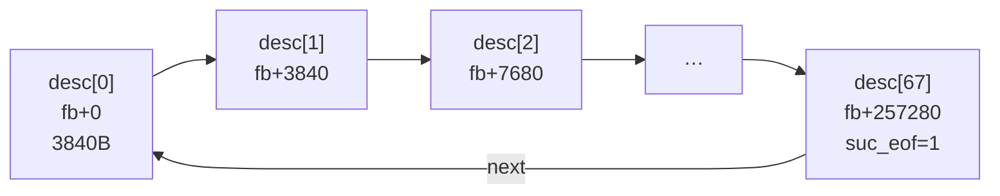

- ディスクリプタのワード0：`size`（bit0-11）、`length`（bit12-23）、`suc_eof`（bit30）、`owner`（bit31 = DMA）。[DescWord0](../rgblcd/calc.go#L158) が作る。
- `descs` は**パッケージのグローバル変数**。DMA が動いている間に GC で回収されないこと、内部 SRAM にあることが必要なため（`OUTLINK_ADDR` はアドレスの下位 20bit しか持たない）。
- オーナーチェック（`OUT_CHECK_OWNER`）を切っているので、DMA が一周してもディスクリプタを書き戻す必要がない。
- LCD_CAM の `LCD_NEXT_FRAME_EN` を立てているので、1フレーム送り終わると LCD_CAM が自分で次のフレームを要求する。**CPU の介入なしで表示が続く**のはこの2つの組み合わせのため。

### 4.6 GPIO マトリクス（[gpio.go](../rgblcd/gpio.go)）

20本のピンそれぞれに「LCD_CAM のどの信号を出すか」を書く。信号番号は ESP-IDF `gpio_sig_map.h` から。

| 信号 | 番号 | GPIO |
|---|---|---|
| LCD_DATA_OUT0〜15 | 133〜148 | B0-4: 8,3,46,9,1 / G0-5: 5,6,7,15,16,4 / R0-4: 45,48,47,21,14 |
| LCD_H_ENABLE（DE） | 150 | 40 |
| LCD_H_SYNC | 151 | 39 |
| LCD_V_SYNC | 152 | 41 |
| LCD_PCLK | 154 | 42 |

`routePin` は「IO_MUX の機能を GPIO（MCU_SEL=1）に → `FUNCn_OUT_SEL_CFG` に信号番号 → 出力を有効化」の順。

### 4.7 初期化の順序（[New](../rgblcd/display.go#L46)・[Start](../rgblcd/display.go#L109)）

ESP-IDF の `esp_lcd_new_rgb_panel` → `esp_lcd_panel_reset` → `esp_lcd_panel_init` → `lcd_rgb_panel_start_transmission` と同じ順序。

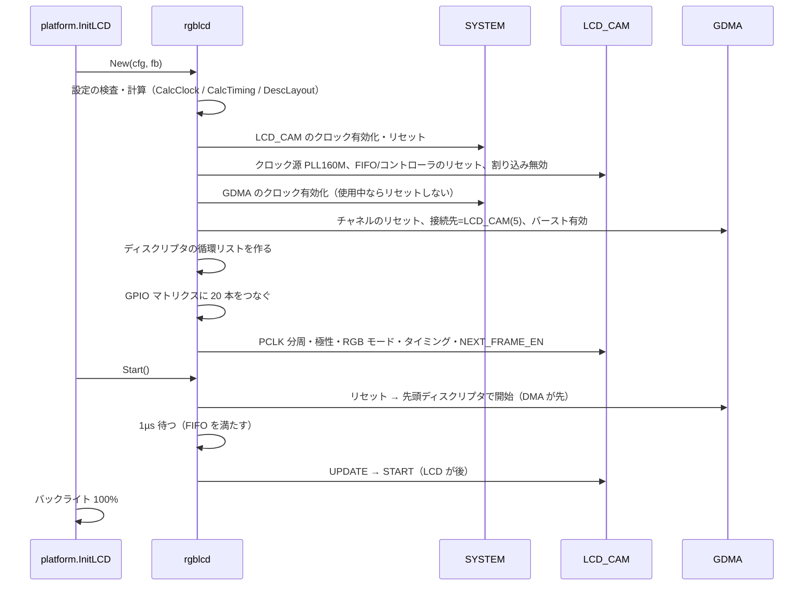

### 4.8 デバッグ用の仕組み

- [Dump()](../rgblcd/display.go#L172)：設定した全レジスタを**読み戻し**、計算した期待値と比べて `OK/NG` を表示する。最後に `=== register check: OK ===`。
- [SelfTest()](../rgblcd/clock.go#L65)：LCD_CAM と GDMA のレジスタに値を書いて読み戻せるかを試す（フェーズ1）。
- [examples/02_colorbars](../examples/02_colorbars/main.go)：上の2つを順に実行し、カラーバーを出す。シリアルで `c r g b w k d` を受け付ける。tick 行に `regs OK`、`fps`、DMA が今どのディスクリプタを読んでいるか（`desc:`）を出す。

### 4.9 ティアリング対策（[WaitVSync](../rgblcd/display.go#L150)）

LCD_CAM はフレームを送り終わるたびに `LC_DMA_INT_RAW` の bit0（VSYNC）を立てる。`WaitVSync` はこのビットを消して、また立つまで**ポーリング**で待つ。割り込みハンドラは使っていない。
`Display()` は何もしない（常に表示されているため）。ゲームは毎フレーム `WaitVSync` の直後に描くことで、描きかけの画面が映りにくくしている。

---

## 5. メモリの使い方

ESP32-S3 の内部 SRAM のうち、TinyGo が使えるのは `0x3FC88000〜0x3FCEB710`（約 398KB、上は ROM と Wi-Fi が使う）。この領域は IRAM（命令）と共有。

```
0x3FC88000 ┌────────────────────────┐
           │ スタック 4KB            │
0x3FC89000 ├────────────────────────┤
           │ .bss                   │ ← descs（1.5KB）と fbMem（255KB）はここ
           │   descs  0x3FC890E4〜   │
           │   fbMem  0x3FC896E4〜   │
           ├────────────────────────┤
           │ .data（フォント等 ~10KB）│
           ├────────────────────────┤
           │ IRAM の影（~2.4KB）      │ ← mapPages など IRAM に置いたコード
           ├────────────────────────┤
           │ ヒープ 約 123KB          │ ← make / new / goroutine のスタック
0x3FCEB710 └────────────────────────┘
```

- **フレームバッファはグローバル配列** [`fbMem`](../platform/platform_esp32s3.go#L17)。`[480*272/2]uint32` と宣言しているのは **4 バイト境界に揃えるため**（`uint16` の配列だと 2 バイト境界の可能性がある）。`rgblcd.New` は境界と「DMA が読める範囲（0x3FC88000〜0x3FD00000）にあるか」を検査する。
- PSRAM（8MB）は使っていない。TinyGo の PSRAM 対応が不明なため。
- Wi-Fi（espradio）を足すとヒープが足りなくなる可能性が高い。

---

## 6. 描画 API とバックエンド

### hal.Display と framebuf

[hal.Display](../hal/hal.go) は tinygo drivers の `Displayer`（`Size`、`SetPixel`、`Display`）に `FillRectangle` を足したもの。tinydraw・tinyfont は `Displayer` しか使わないので、そのまま動く。

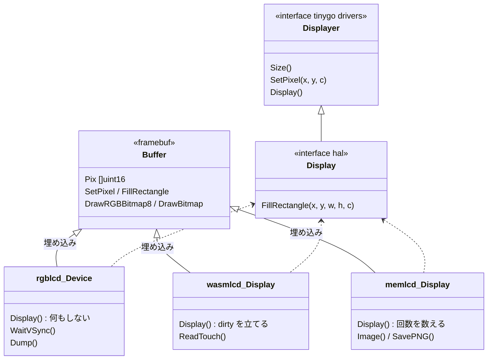

- 3つのバックエンドは**同じ形式のフレームバッファ**（`[]uint16`、RGB565、行優先）を `framebuf.Buffer` として埋め込んでいる。違うのは「バッファがどう画面に届くか」だけ。
- `FillRectangle` は1行目を埋めてから `copy` で下の行に複製する（ループより速い）。
- `DrawRGBBitmap8` は **RGB565BE のバイト列**を受け取る。画像ファイル（.rgb565、slidepack）とゲームのスプライト描画がこれを使う。

---

## 7. ブラウザ版（wasmlcd）

[wasmlcd.go](../wasmlcd/wasmlcd.go) は canvas に描く。

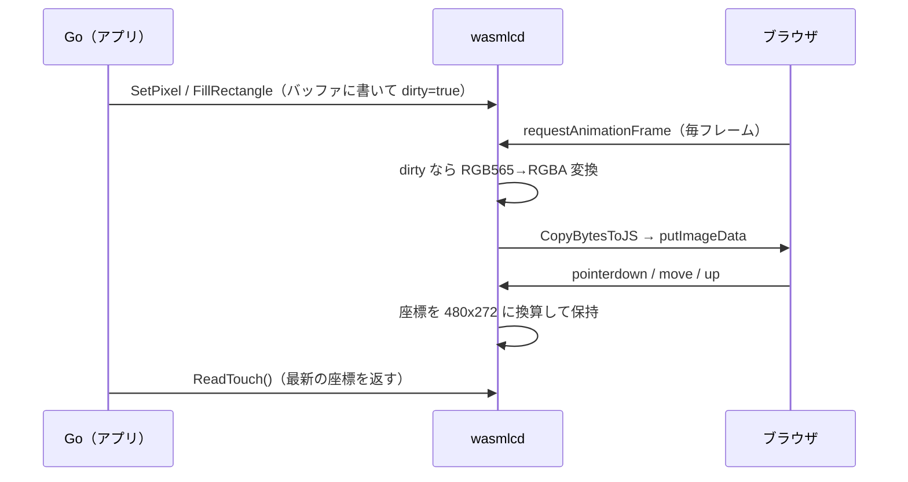

- `wasm_exec.js` は **TinyGo 付属のもの**を使う（Go 付属のものは互換性がない）。`make wasm` が毎回コピーする。
- `.wasm` は `application/wasm` の MIME で配信する必要があり、`file://` では動かない。`make serve`（[tools/serve](../tools/serve/main.go)）がそうする。
- `main` から return するとプログラムが終わるので、ループで回し続ける。
- headless Chromium での検査用に、`window.wasmlcdFlush_lcd()` で即座に canvas へ転送できる。headless の仮想時間モードでは requestAnimationFrame が来ないため。

---

## 8. テスト

| 種類 | 場所 | 何を確かめるか |
|---|---|---|
| 計算 | [rgblcd/calc_test.go](../rgblcd/calc_test.go) | PCLK 分周・タイミング値・ディスクリプタを、ESP-IDF の式から手計算した値と比較 |
| ゴールデン画像 | [app](../app/app_test.go)、[05](../examples/05_slideshow/main_test.go)、[07](../examples/07_breakout/game_test.go)、[08](../examples/08_invaders/game_test.go) | memlcd で描いた画面を `testdata/golden/*.png` とピクセル単位で比較 |
| ロジック | 各 `_test.go` | タッチ操作、スライドの切り替え、ゲームの自動プレイ、BMP 変換など |
| ブラウザ | [tools/wasmcheck](../tools/wasmcheck/wasmcheck_test.go) | headless Chromium で canvas を読み、同じゴールデン画像と比較 |

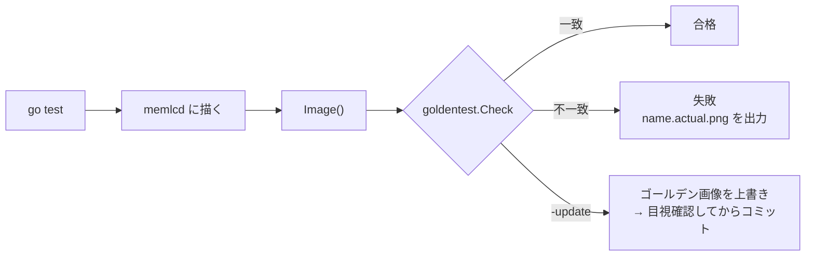

- 画面を意図して変えたら `make update-golden` で更新し、**画像を目で見てから**コミットする。
- 実機でしか確かめられないもの：レジスタ設定、RAM 容量、描画速度、ティアリング、液晶の発色、タッチの精度、SD カード、Wi-Fi。

---

## 9. タッチパネル

- XPT2046（抵抗膜）。tinygo drivers の [xpt2046](https://github.com/tinygo-org/drivers/tree/release/xpt2046) を使う。このドライバは **SPI を GPIO で1ビットずつ操作（ビットバング）** しており、読み取りに時間がかかる。
- ピン：SCK=12、MOSI=11、MISO=13、CS=38、INT=18（押されると Low）。SCK/MOSI/MISO は microSD と共有。
- [xpttouch.ReadRaw](../xpttouch/xpttouch.go#L30)：ドライバが返す 16bit 値を 12bit に戻す。[Calibration.Map](../xpttouch/calib.go#L18)：raw 値を画面座標に線形変換し、画面内に収める。
- キャリブレーション値は [board.go](../board/board.go) の `TouchRaw*`（実測：X 172〜3940、Y 3884〜329、軸の入れ替えなし）。測り直しは [04_touch](../examples/04_touch/main.go)。
- [FromCorners](../xpttouch/calib.go#L48)：4隅のタップから値を求める。軸の入れ替わりを検出し、範囲が狭すぎる・同じ辺の2点が食い違う・向きが逆、のときは失敗にする。

---

## 10. フラッシュとスライドショー（05）

### 10.1 なぜ画像をプログラムに埋め込まないのか

TinyGo の ESP32-S3 は **ESP-IDF の2段目ブートローダを使わず、ROM が直接プログラムを読み込む**。ROM は約 1MB の rodata セグメントを「Invalid image block, can't boot」と拒否した。
そこで、画像は**プログラムとは別にフラッシュの 8MB 位置に書き**、実行時に MMU でメモリとして見えるようにして読む。

### 10.2 フラッシュの配置（16MB）

```
0x000000 ┌──────────────────────────┐
         │ プログラム（数十〜数百KB）  │ ← make flash / make flash-noerase
         │                          │
0x800000 ├──────────────────────────┤ ← board.SlidesFlashOffset
         │ slides.pack（1枚 255KB）   │ ← make flash-slides
         │                          │
0xFFFFFF └──────────────────────────┘
```

| コマンド | 何をするか | スライドは |
|---|---|---|
| `make flash` | `tinygo flash`。**フラッシュ全体を消去**してからプログラムを書く | **消える** |
| `make flash-noerase` | `tinygo build` で .bin を作り、espflasher で 0 番地に書く | 残る |
| `make flash-slides` | espflasher で `slides.pack` を 0x800000 に書く（`-fs 16MB` が必要） | 書かれる |

`-fs 16MB` がないと、espflasher（の書き込み用スタブ）は 4MB までしか書かせず、エラー 0xC4 になる。フラッシュサイズの自動検出はプログラムのイメージ（先頭 0xE9）でしか行われないため。

### 10.3 MMU マッピング（[flashmap.Map](../flashmap/flashmap.go#L70)）

ESP-IDF の `esp_mmu_map` と同じ手順。データキャッシュを止めている間はフラッシュを読めないので、その間に動くコード（[mapPages](../flashmap/flashmap.go#L92)）は `//go:section .iram1...` で **IRAM に置く**。

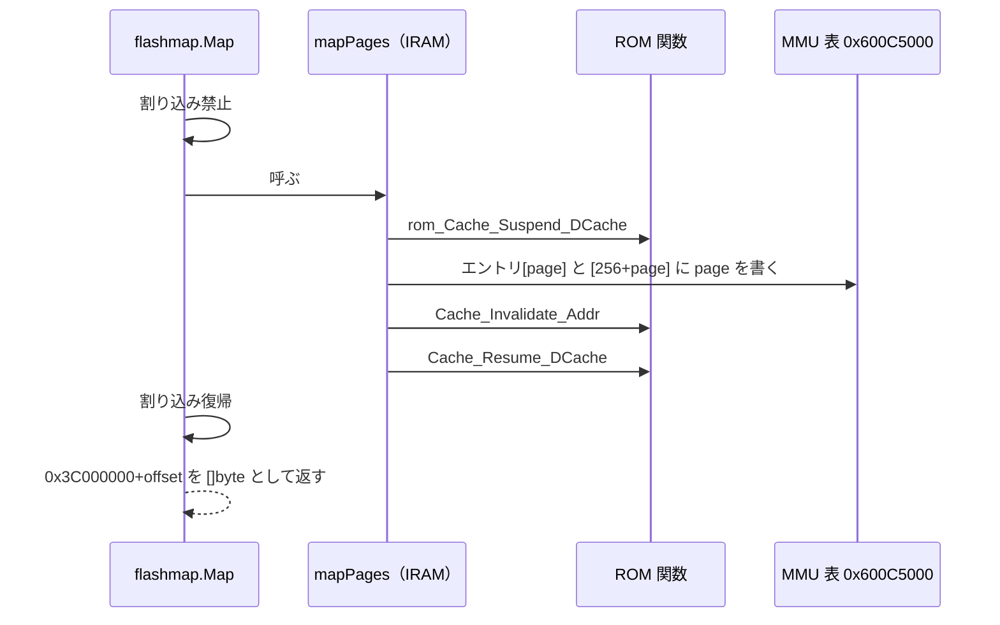

- ROM 関数の番地は TinyGo のリンカスクリプトにないので、ターゲットの `ldflags` に `--defsym` で書いている。
- エントリを2か所に書いているのは、ESP-IDF の解釈と TinyGo の起動コードの解釈が違い、どちらが正しいか決められなかったため（[14章](#14-未解決注意事項)）。

### 10.4 slidepack 形式（[slidepack.go](../slidepack/slidepack.go)）

```
0x0000  "SLD1"  幅(u16) 高さ(u16) 枚数(u32) 画像の開始位置(u32=4096) 1枚のサイズ(u32)
0x0014  名前 32 バイト × 枚数
0x1000  画像0（RGB565BE、480×272×2 = 261,120 バイト）
        画像1 …
```

作り方：`make slides`（= `go generate` → [tools/img2rgb565](../tools/img2rgb565/main.go) `-pack`）。変換は CatmullRom で縮小、`cover`（切り抜き）/`contain`（黒帯）、Floyd–Steinberg ディザリング。

05 は読み込み元をビルドタグで切り替える：実機は [source_flash.go](../examples/05_slideshow/source_flash.go)（flashmap）、ブラウザ・ホストは [source_embed.go](../examples/05_slideshow/source_embed.go)（`go:embed`）。

### 10.5 slideshow パッケージ

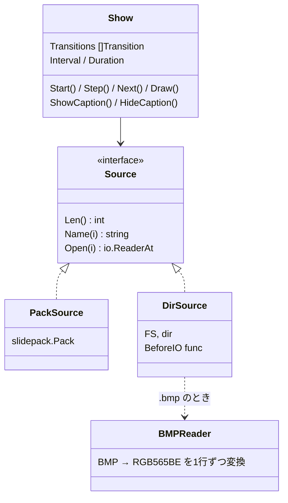

- 画像は**全部をメモリに読まない**。`ReadAt` で 8 行ずつ（15KB）読んで `DrawRGBBitmap8` で描く。
- 切り替え効果：Cut（一度に）、WipeDown（8行ずつ上から）、WipeRight（40列ずつ左から）、Blinds（8本の帯を1行ずつ）。
- キャプションは2秒後、**その部分の画像をもう一度読み直して**消す（`HideCaption`）。そのため `Source.Open` が返したリーダーは、次の `Open` まで有効である必要がある。
- タッチは**押し始めた瞬間**だけ反応する（`newPress`）。押し続けても繰り返さない。

---

## 11. SD カードのスライドショー（06）

- SD カード：CS=10、SCK/MOSI/MISO はタッチと共有。**FAT32、MBR** のみ（exFAT・GPT は tinyfs の FatFs 設定で無効）。
- 読める画像：480×272 の `.bmp`（24/32bit、無圧縮）と `.rgb565`。JPEG/PNG は RAM 不足で実機では展開しない。
- 名前が `.` で始まるファイル（macOS の `._xxx`）は無視。

### 共有 SPI バス（[bus.go](../examples/06_sdslideshow/bus.go)）

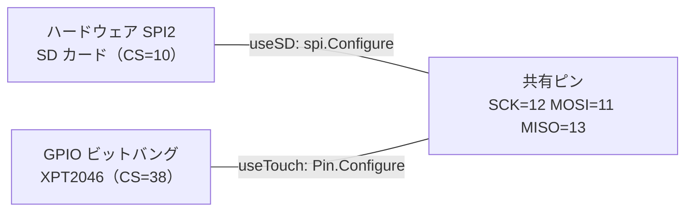

- SD を読む直前（`DirSource.BeforeIO`）に `useSD`：ピンを SPI に戻し、タッチの CS を High。
- タッチを読む直前（`busTouch.ReadTouch`）に `useTouch`：ピンを GPIO に戻し、SD の CS を High。
- 今どちらか（`mode`）を覚えているので、切り替えは必要なときだけ。

### C の malloc（[internal/espmalloc](../internal/espmalloc/espmalloc.go)）

tinyfs の fatfs は C コードで `malloc` を呼ぶ。ESP32-S3 のターゲットは `--wrap=malloc` でリンクするので、`malloc` の呼び出しは `__wrap_malloc` に向かう。普通は Wi-Fi ドライバ（espradio）が用意するが、使っていないと未定義になる。espmalloc は `__wrap_malloc` → `__real_malloc`（TinyGo のランタイムの malloc）と転送するだけ。**espradio と一緒に使うとシンボルが重複する。**

---

## 12. ゲーム（07・08）

### ゲームループ（[07 main.go](../examples/07_breakout/main.go)、[08 main.go](../examples/08_invaders/main.go)）

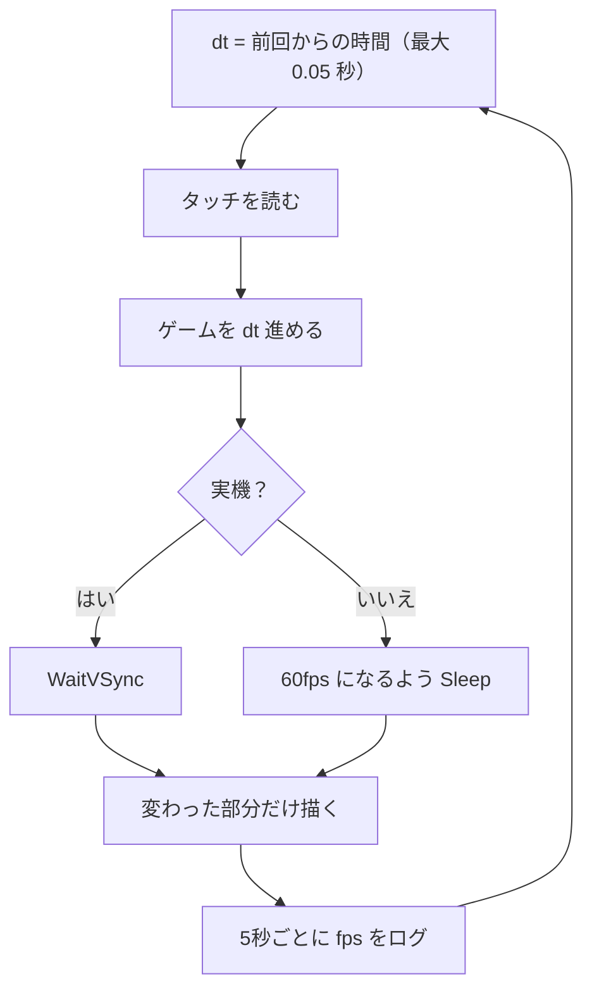

### 差分描画

毎フレーム全画面（261KB）を描き直さず、変わった所だけ描く。

| 対象 | 方法 |
|---|---|
| 07 パドル | 動いた分の「はみ出た部分」だけ背景色で消し、新しい位置に描く（消してから描くとちらつく） |
| 07 ボール・弾 | 古い位置を背景色で消し、新しい位置に描く（小さいので問題にならない） |
| 08 スプライト | 古い位置と新しい位置を合わせた矩形を**1枚の画像として作り**、`DrawRGBBitmap8` で1回で描く（`blit`） |
| 消えたブロック・敵 | その矩形だけ背景色にする |
| スコア | 変わったときだけ上の帯を描き直す |

### 07 ブロック崩し（[game.go](../examples/07_breakout/game.go)）

- ボールは1回に**最大 2px** ずつ、**横と縦を別々に**動かす。ブロックに重なったら、その軸だけ位置を戻して速度の符号を反転する。速くなってもすり抜けない。
- パドルに当たった位置で角度が決まる（中央 = 真上、端 = 60°）。
- 速さ：220 px/s × (1 + 0.1 × (レベル − 1))。

### 08 インベーダー（[game.go](../examples/08_invaders/game.go)）

- 元祖と同じく、**1フレームに1体ずつ**動かす（[stepInvader](../examples/08_invaders/game.go#L631)）。全員が1歩動くのに「生きている数」フレームかかるので、数が減るほど速くなる。
- 1周（全員が1歩）の間に誰かが端に着いたら、次の1周は全員が下に 8px 移動し、向きが反転する。
- 弾は 4px ずつ動かして当たり判定（すり抜け防止）。爆弾は同時に3発まで、乱数（xorshift、テストでは固定シード）で落とす。
- トーチカは 4×4px のセルの集まりで、当たったセルだけ消える。

---

## 13. 運用：コマンド・よくある作業・トラブル

### Makefile

| コマンド | 内容 |
|---|---|
| `make flash PKG=...` | 書き込み＋モニタ（**フラッシュ全消去**） |
| `make flash-noerase PKG=...` | 消去せずに書き込み（スライドを残す） |
| `make flash-slides` | slides.pack を 0x800000 に書く |
| `make monitor` | シリアルモニタ（115200bps） |
| `make examples` | 全 example と cmd/app を実機向けにビルド |
| `make wasm PKG=...` / `make serve` | ブラウザ版のビルドと配信 |
| `make test` | ホストのテスト |
| `make test-browser PKG=... GOLDEN=... DUMP_MS=...` | headless Chromium で canvas とゴールデン画像を比較 |
| `make update-golden` | ゴールデン画像の更新 |
| `make slides` | images/ → slides.pack |

### よくある作業

| やりたいこと | 変える場所 |
|---|---|
| PCLK・ポーチを変える | [board.go](../board/board.go) の定数。`rgblcd/calc_test.go` は board を参照しない（式の検証）ので変更不要。実機で 02_colorbars の Dump が OK になることを確かめる |
| ピンを変える（別の基板） | `board` と `platform.RGBConfig()`。`rgblcd` 本体は変えない |
| タッチがずれる | 04_touch で測り直し、`board.TouchRaw*` を書き換える |
| スライドの画像を変える | `examples/05_slideshow/images/` → `make slides` → `make flash-slides`（テストのゴールデン画像は1枚目に依存） |
| 新しい example を作る | `examples/NN_name/main.go`。`machine` を使うならビルドタグ。`Makefile` の `EXAMPLES` に追加 |
| 画面の見た目を変えた | `make test` → 失敗 → `*.actual.png` を確認 → `make update-golden` → 目視 → コミット |

### トラブルシューティング

| 症状 | 原因と対処 |
|---|---|
| 真っ暗 | バックライト（GPIO2）。01_backlight で確認 |
| 色がおかしい | データピンの順番。02_colorbars で `r`/`g`/`b` を送って1色ずつ確認 |
| 横ずれ・ジッタ・ちらつき | ポーチ値、PCLK が高い。PCLK を下げる |
| 絵が1周ごとにずれる | ディスクリプタの長さの合計が1フレームと違う。Dump の `total length` |
| `=== register check: NG ===` | NG の行のフィールドを見る。計算値と書き込み手順を確認 |
| 05 で `bad magic` | スライドが書かれていない／`make flash` で消えた → `make flash-slides` |
| `fatal error: deadlocked: no event source` | 実機で `select {}`。`platform.Halt()` を使う |
| `undefined symbol: __wrap_malloc` | C コードを使うのに espmalloc を import していない |
| `package machine is not in std`（go test） | `machine` を使うファイルにビルドタグがない |
| ブラウザで真っ白 | `file://` で開いている、wasm_exec.js が Go 付属、MIME が違う |
| `make flash-slides` が 0xC4 | `-fs 16MB` がない |
| `Invalid image block, can't boot` | プログラムに大きなデータを埋め込んだ（rodata が大きい） |

---

## 14. 未解決・注意事項

- **起動時の `SHA-256 comparison failed`**：ROM が計算したハッシュとイメージのハッシュが違う。起動は続くので実害はないが、原因は未調査。
- **MMU エントリを2か所に書いている**：ESP-IDF（共有の表、エントリ = 仮想アドレス >> 16）と TinyGo の起動コード（DROM はエントリ 256〜）の解釈の違い。どちらで動いているかは未確認。
- **06 は実機で未確認**：SD カードの動作確認がまだ。SPI 10MHz で画素化けする場合は `sdFrequency` を 4MHz に。
- **タッチの読み取りが遅い**：xpt2046 ドライバがビットバングで、各クロックで `time.Sleep` を呼ぶ。ゲームの fps が下がるならサンプル数を減らす。
- **PSRAM と Wi-Fi は未使用**：使う場合はメモリ計画（[5章](#5-メモリの使い方)）を見直す。
- **フェーズ8（VSYNC 割り込み）・フェーズ10（メモリ節約モード）は未実装**。
